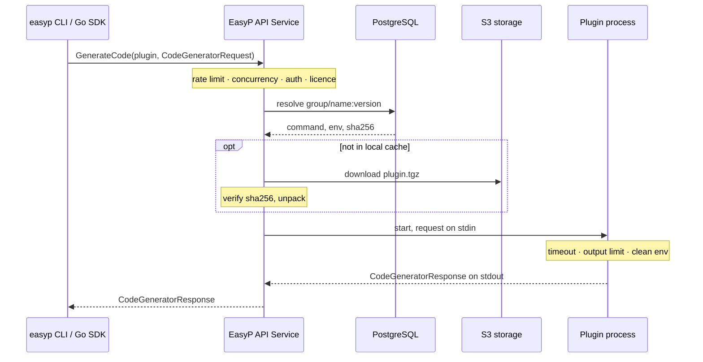

The EasyP API Service runs protobuf code-generation plugins on a server. A client
sends a `google.protobuf.compiler.CodeGeneratorRequest` over gRPC and names a
plugin; the service runs that plugin as a child process and returns the
`CodeGeneratorResponse`. Developers and CI no longer install plugins: they name
a version that the operator has registered once.

It is self-hosted. You run it, you decide which plugins exist, and the `.proto`
files you generate from never leave your network.

## The problem it addresses

- **Plugin versions drift between machines.** Two developers with different
  `protoc-gen-go` builds produce different generated code from the same schema,
  and CI produces a third.
- **Every new machine is an installation.** Each plugin, often in a different
  language toolchain (Go, Node, JVM, Swift, Python), has to be installed and
  kept in step on every laptop and runner.
- **Nobody decides which versions are allowed.** Without a central list, a
  plugin version is whatever someone last installed.

With the service, the plugin version is part of the configuration
(`remote: host/protocolbuffers/go:v1.36.10`), and the binary behind that name is
the same for every caller.

## How it works

1. The client parses `.proto` files locally and builds one `CodeGeneratorRequest`
   per plugin.
2. The service admits the request (rate limit, per-caller concurrency,
   authentication, licence) and resolves the plugin by `group/name:version` in
   PostgreSQL.
3. If object storage is configured and the plugin is not in the local cache, the
   archive is downloaded, checked against the sha256 recorded at registration,
   and unpacked.
4. The plugin runs as a child process with a timeout, an output-size limit and
   only the environment its own configuration declares.
5. The response goes back to the client, which writes the files.

The full request path is in [Architecture](/docs/api-service/architecture).

## What it is not

- **Not a sandbox.** Plugins run as ordinary processes on the service host.
  Time, output size, concurrency and environment are bounded; memory, CPU,
  filesystem and network are not. Registering a plugin is equivalent to running
  code on that host. Read [Security](/docs/api-service/security) before
  exposing write access to anyone.
- **Not a schema registry.** It stores plugin versions, not `.proto` modules.
  Dependencies are handled by the easyp CLI through Git — see
  [Package manager](/docs/cli/package-manager).
- **Not a package publisher.** It returns generated files to the caller; it does
  not publish Go modules, npm or Maven packages.
- **Not horizontally scalable.** One replica per plugin cache volume. Scale by
  giving the pod more CPU and raising the generation limit.
- **Not a hosted service you can sign up for.** The documentation describes the
  software you deploy.

## When to use it

- Several teams or many CI runners generate code and must get byte-identical
  output.
- The `.proto` sources may not leave your network, or the build network has no
  internet access.
- You want to control exactly which plugins and versions can be used, including
  internal plugins.
- You already operate PostgreSQL, object storage and Prometheus, so running one
  more stateless-ish service is cheap.

## When not to use it

- One developer or one repository: local plugins or the easyp CLI's built-in
  WASM plugins are simpler.
- You need generated SDKs published to package managers, a hosted schema
  registry, or an organisation/role model — see
  [EasyP vs Buf BSR](/docs/api-service/vs-buf-bsr), which lists where BSR is the
  better fit.
- You cannot accept running third-party plugin binaries on a host inside your
  network without a sandbox, and cannot isolate that host yourself.

## Editions

The same binary serves both. Without a licence it runs as **Community**:
everything except the audit log, with ceilings of 4 lookup workers, 10
registered plugin versions and 16 concurrent generations. An **Enterprise**
licence adds the audit log and removes the ceilings. Details:
[Authentication and licensing](/docs/api-service/authentication-and-licensing).

The service source is under the Elastic License 2.0; the gRPC contract (`api/`)
and the Go SDK (`sdk/`) are Apache-2.0.

## Where to go next

| Task | Page |
|---|---|
| Run it locally and generate code | [Quickstart](/docs/api-service/quickstart) |
| Deploy it | [Installation](/docs/api-service/installation), [Configuration](/docs/api-service/configuration) |
| Add plugins | [Plugins](/docs/api-service/plugins), [Operator CLI](/docs/api-service/operator-cli) |
| Point clients at it | [Client usage](/docs/api-service/client-usage) |
| Operate it | [Observability](/docs/api-service/observability), [Runbooks](/docs/api-service/runbooks), [Backup](/docs/api-service/backup), [Upgrading](/docs/api-service/upgrading) |
| Compare with Buf | [EasyP vs Buf BSR](/docs/api-service/vs-buf-bsr), [Migrating from BSR](/docs/api-service/migrating-from-bsr) |

Source and issues: [github.com/easyp-tech/service](https://github.com/easyp-tech/service).
Community chat: [Telegram](https://t.me/easyptech).
