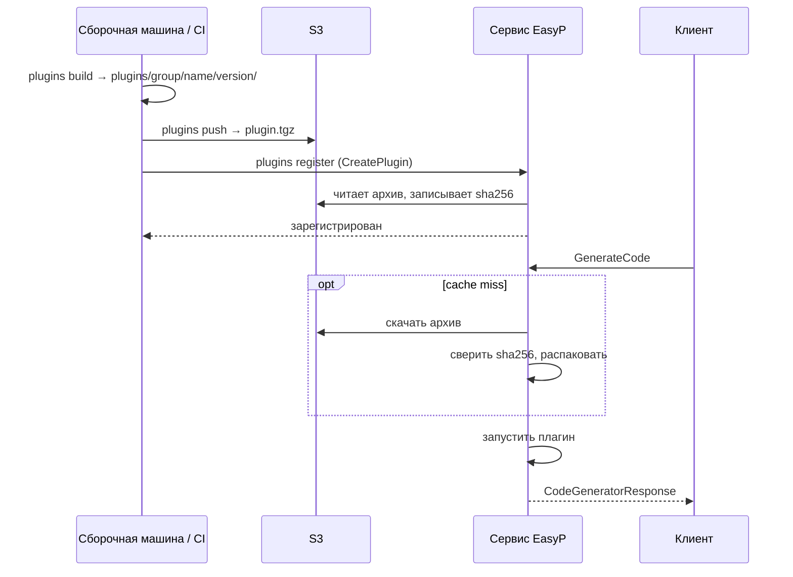

## Имена

Плагин адресуется как `group/name:version`, например
`protocolbuffers/go:v1.36.10`.

- `group` и `name`: строчные латинские буквы, цифры и `-`, начинаются с буквы.
- `version`: `vX.Y` или `vX.Y.Z` (у самого protobuf релизы вида `v33.1`) либо
  `latest`.

`latest` выбирает зарегистрированную версию, которая оказывается последней **при
сравнении строк**. Если зарегистрированы `v1.36.9` и `v1.36.10`, вернётся
`v1.36.9`. Фиксируйте версии во всех конфигурациях, где это важно.

## Каталог

Каталог `registry/` репозитория сервиса содержит рецепт сборки для каждого
плагина, который публикует easyp-tech. В v1.0.2 это **80 плагинов, из которых собирается 1522 различных версии** (перечислено 1743; почему — см. [каталог](/ru/docs/api-service/plugin-catalog))
в десяти группах:

| Группа | Плагинов |
|---|---|
| `protocolbuffers` | 12 |
| `grpc` | 13 |
| `bufbuild` | 15 |
| `connectrpc` | 9 |
| `community` | 23 |
| `grpc-ecosystem` | 2 |
| `apple` | 2 |
| `anthropics` | 2 |
| `googlecloudplatform` | 1 |
| `pluginrpc` | 1 |

Все плагины и версии перечислены в [Каталоге плагинов](/ru/docs/api-service/plugin-catalog),
который генерируется из этих файлов.

Каталог — это книга рецептов, а не набор готовых артефактов: каждое
развёртывание само собирает и регистрирует нужные ему версии. Лицензия Community
допускает всего 10 зарегистрированных версий.

## Каталог одного плагина

<Files>
  <Folder name="registry/grpc/go" defaultOpen>
    <File name="Dockerfile — принимает ARG VERSION, собирает /plugin" />
    <File name="plugin.yaml — какие версии собирать" />
  </Folder>
</Files>

```yaml
# registry/protocolbuffers/go/plugin.yaml
build_args:
  GO_MODULE: google.golang.org/protobuf/cmd/protoc-gen-go
versions:
  - v1.36.10
  - v1.36.9
```

Необязательные ключи `plugin.yaml`: `build_args` (передаются в каждую сборку),
`dockerfile` (другой файл), `args` (аргументы entrypoint). Элемент версии может
быть отображением, которое переопределяет их для себя или задаёт `skip: true`.

### Что должен собрать Dockerfile

- **Исполняемый файл `/plugin`.** Читает `CodeGeneratorRequest` из stdin, пишет
  `CodeGeneratorResponse` в stdout и завершается с ненулевым кодом при ошибке.
- **Всё, что ему нужно, рядом.** Вся файловая система образа распаковывается в
  каталог версии и поставляется вместе: jar, `node_modules`, разделяемая
  библиотека.
- **Один рецепт на все версии**, версия выбирается через `ARG VERSION`.
- По соглашению в этом репозитории: финальная стадия `scratch` или distroless,
  запуск от `nobody`, базовые образы по digest, статические бинарники там, где
  язык позволяет.

Сервис не запускает образ. Docker нужен только при сборке, чтобы получить каталог
с файлами; во время работы сервис запускает `plugin` из этого каталога как
обычный процесс.

## От рецепта до работающего плагина



1. **build** — `easyp-svc plugins build <registry-path>` запускает Docker-сборку
   на каждую версию и распаковывает результат в `--output` (по умолчанию
   `plugins/`). Нужен Docker. Получаются линуксовые бинарники.
2. **push** — упаковывает каталог каждой версии в `plugin.tgz` и загружает. В
   локальном режиме пропускается. `plugins pack` + `plugins push --packed`
   позволяют разнести это по разным машинам.
3. **register** — вызывает `CreatePlugin` для каждой версии с путём к команде в
   том виде, в каком его увидит сервис (`--plugins-prefix`, по умолчанию
   `/plugins`). Нужен токен записи.

**Push — до register.** С включённым объектным хранилищем регистрация версии без
архива падает с `FAILED_PRECONDITION` / `BINARY_NOT_UPLOADED`. Контрольную сумму
сервис считает сам, так что клиент не может зарегистрировать хеш по своему
выбору.

### `push --force` после register ломает контрольную сумму [#push-force-after-register]

Объект меняется под
записанным хешем. Сервис, у которого версия уже распакована, продолжает запускать
старый бинарник: сумма проверяется только при скачивании; при холодном кеше
скачивание падает с `plugin archive checksum mismatch`. Повторная регистрация не
помогает — `CreatePlugin` отвечает `ALREADY_EXISTS`, а `plugins register` считает
версию пропущенной. Либо выпустите изменение новой версией, либо сначала удалите
версию (`DeletePlugin` удаляет строку, архив и закешированную копию), затем push и
register. `UpdatePlugin` с конфигом пересчитывает сумму, но уже распакованную
копию не трогает.

В **локальном режиме** (без бакета) шаг 2 пропускается, а файлы должны лежать в
`plugins_dir` на диске сервиса — смонтированные, скопированные или вшитые в
производный образ.

Все команды и флаги — в [CLI оператора](/ru/docs/api-service/operator-cli).

## Зарегистрированная конфигурация

Каждая зарегистрированная версия — одна строка таблицы `plugins`. Её `config`:

```json
{
  "command": ["/plugins/protocolbuffers/go/v1.36.10/plugin"],
  "env": {},
  "timeout": "60s",
  "sha256": "9f2c…"
}
```

| Поле | Смысл |
|---|---|
| `command` | Исполняемый файл и аргументы. `command[0]` должен разрешаться внутрь `registry.plugins_dir`; проверяется при регистрации и повторно перед каждым запуском после разрешения симлинков. |
| `env` | Всё окружение плагина. От сервиса ничего не наследуется. |
| `timeout` | Необязательный лимит плагина внутри `worker_pool.generation_timeout`. |
| `sha256` | Записывается сервисом по архиву в хранилище. В локальном режиме отсутствует. |

`UpdatePlugin` принимает маску полей (`config`, `tags`); изменение пересчитывает
контрольную сумму. `DeletePlugin` удаляет строку и, при объектном хранилище,
архив и закешированный каталог.

## Добавление плагина [#adding-a-plugin]

**В публичный каталог:** добавьте `registry/<group>/<name>/` с `Dockerfile` и
`plugin.yaml` — в `community/<author>-<tool>`, если проект не относится к одной
из именованных групп, — и откройте pull request в
[easyp-tech/service](https://github.com/easyp-tech/service). Среди шаблонов
issue в репозитории есть запрос плагина.

**Только для своего развёртывания:** те же два файла в своём дереве каталогов.
`plugins build` принимает любой путь к реестру, а регистрации всё равно, откуда
взят рецепт. Приватные плагины не нужно никуда публиковать.

Прежде чем регистрировать плагин, написанный кем-то другим, прочитайте
[Безопасность](/ru/docs/api-service/security): плагин работает с привилегиями
сервиса.

## Связь с bufbuild/plugins

Раскладка по группам и набор плагинов повторяют
[bufbuild/plugins](https://github.com/bufbuild/plugins) (Apache-2.0) — каталог,
на котором построены remote plugins Buf: те же десять владельцев и то же
именование `community/<author>-<tool>`. Рецепты написаны под сборку этого сервиса
(один Dockerfile на плагин с `ARG VERSION`, список версий в `plugin.yaml`,
entrypoint `/plugin`), а не скопированы по версиям. Каталоги сопровождаются
отдельно, и списки версий в них различаются.
